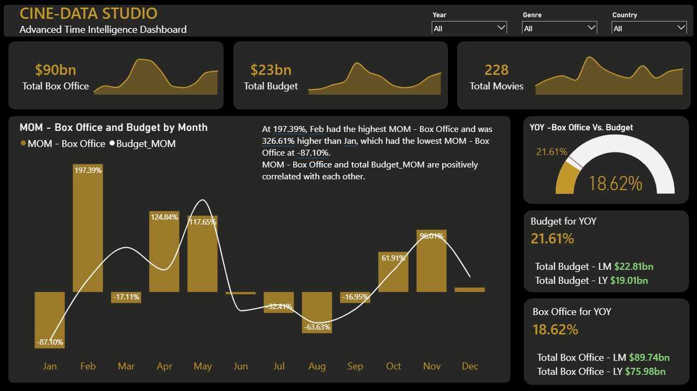

🎬 Lights, Camera, Data! 🚀

I’m thrilled to share my latest project: the CINE-DATA STUDIO dashboard, a premium analytical tool designed to uncover deep financial performance trends in the film industry.

For this project, my main focus wasn't just visualizing data, but building a robust Time Intelligence logic using DAX to extract dynamic, actionable insights that help decision-makers compare performance across complex periods seamlessly.

🧠 Deep Dive into the Analytics & Time Intelligence:
MoM (Month-over-Month) Dynamics: Engineered dynamic measures to track performance velocity. For instance, the data reveals a massive spike in February where MOM - Box Office surged by 197.39%, marking a staggering 326.61% recovery from January’s lowest dip (-87.10%).

YoY (Year-over-Year) & Period Comparisons: Built advanced DAX formulas to compare current performance against historical benchmarks (Last Month - LM and Last Year - LY).

Budget vs. Box Office Efficiency:

Total Budget grew by 21.61% YoY (reaching $22.81bn compared to $19.01bn LY).

Total Box Office followed with a strong 18.62% YoY growth (hitting $89.74bn compared to $75.98bn LY).

This comparison instantly tells a story: while spending increased, the revenue return closely matched the growth trajectory, proving dynamic budget efficiency.

🛠️ Tech Stack & Features:
Advanced Power BI & DAX: Implemented custom Time Intelligence functions for rolling periods, MoM, and YoY tracking.

UI/UX Design: Crafted a premium Dark Mode interface with gold accents to elevate visual hierarchy, keeping cognitive load to a minimum while emphasizing KPIs.

Dynamic Filtering: Enabled granular slicers (Year, Genre, Country) that dynamically recalculate all time-intelligent metrics on the fly.

With $90bn in Total Box Office, $23bn in Total Budget, and 228 Movies analyzed, this dashboard acts as a strategic compass for film production performance.

I’d love to hear your thoughts on the design and the data architecture! Drop your feedback in the comments. 👇

#PowerBI #DataAnalysis #TimeIntelligence #DAX #BusinessIntelligence #DataVisualization #Dashboard #DataAnalytics
